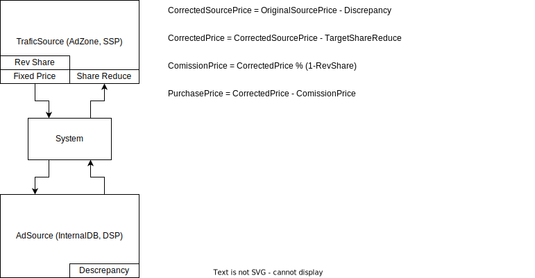

# AdCoreLib - Core Functions Library for Advertising Software

[](https://github.com/geniusrabbit/adcorelib/actions?workflow=Tests)
[](https://goreportcard.com/report/github.com/geniusrabbit/adcorelib)
[](https://godoc.org/github.com/geniusrabbit/adcorelib)
[](https://coveralls.io/github/geniusrabbit/adcorelib)

AdCoreLib is a library of core functions for advertising software, intended for personal and company use. It supports the development of internal advertising services but prohibits providing commercial services to other companies and individuals.

This project contains common library packages for advertising software.

### Prices Math

- **ComissionShareFactor**: Represents the internal commission of the system.
- **RevenueShareFactor**: Represents the revenue of the publisher or advertiser.

RevenueShareFactor is calculated as:

```js
RevenueShareFactor = 1.0 - ComissionShareFactor
```

For example, if:

- ComissionShareFactor = 10% (0.1)
- RevenueShareFactor = 90% (0.9)
- RevenueShareReduce = 10%

The new price calculation:

```js
newPrice = (price * (1 - RevenueShareReduce)) - (price * ComissionShareFactor)
```

For example:

```js
newPrice = price * (1 - 0.1) * (1 - 0.1) = 0.81
```

### Source and Target Calculations

**Source:**

- `ComissionShareFactor` and `RevenueShareReduce`
  - `newPrice = (price * (1 - RevenueShareReduce)) - (price * ComissionShareFactor)`

**Target (Zone + Site, AccessPoint{DSP}):**

- `ComissionShareFactor` and `RevenueShareReduce`
  - `publisherPrice = price - (price * ComissionShareFactor) - (price * RevenueShareReduce)`

If the target has a fixed view price, that value can be used instead. If the target is an AccessPoint, `RevenueShareReduce` will reduce discrepancy.

We have two types of commissions:

1. From source to reduce discrepancy between buyer (DSP) and seller.
2. From target.

### Example Price Calculation



- `CorrectedSourcePrice = OriginalSourcePrice - Discrepancy`
- `CorrectedPrice = CorrectedSourcePrice - TargetShareReduce`
- `ComissionPrice = CorrectedPrice % (1 - RevShare)`
- `PurchasePrice = CorrectedPrice - ComissionPrice`

## TODO

- [ ] Add documentation
- [ ] Reorganize package structure

## License

[LICENSE](LICENSE)
