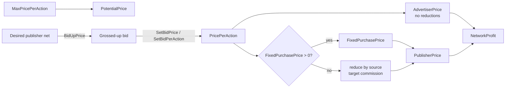
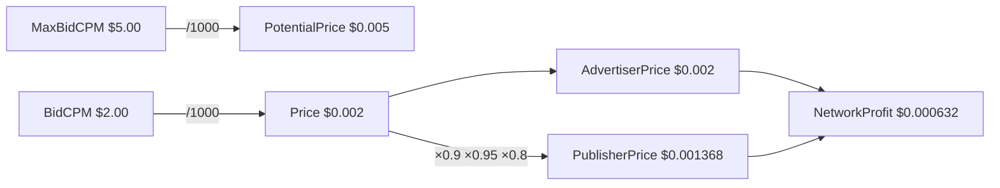
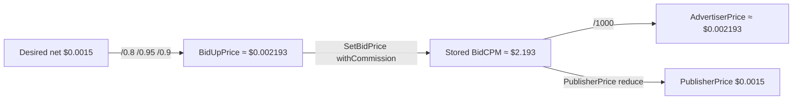

# Prices (`adtype/prices`)

Package [`adtype/prices`](../adtype/prices/) computes the money values of every
advertisement action: what the advertiser pays, what the publisher receives, and
what remains as network margin. It knows nothing about auction type or which of
the simultaneously active pricing models (CPM / CPMV / CPC / CPA) should be
charged — that is the responsibility of the auction and RTB integration modules.

Source of truth for the formulas: [`calculator.go`](../adtype/prices/calculator.go),
[`factors.go`](../adtype/prices/factors.go),
[`price_scope.go`](../adtype/prices/price_scope.go),
[`bid.go`](../adtype/prices/bid.go).

---

## Overview — three prices and network profit

Every action resolves to three money values, plus an explicit margin:

| Concept | Meaning |
| --- | --- |
| **PotentialPrice** | Maximum the advertiser *could* have paid (`MaxPrice`). Not reduced by any factor. Used to track discrepancy between expected and real charge. |
| **AdvertiserPrice** | Amount charged from the advertiser. Equal to the current (post-auction) bid **as is** — no source/target/commission reduction. The advertiser covers the full cost of running traffic, discrepancies included. |
| **PublisherPrice** | Amount paid to the publisher. Same bid reduced by source and target discrepancy corrections and by the network commission, **or** a fixed purchase price if the target defines one. |
| **NetworkProfit** | `AdvertiserPrice − PublisherPrice`. Captures both the commission share and whatever the discrepancy corrections deducted from the publisher payout. |

Invariant (non-fixed publisher prices, factors in `0..1`):

```text
PublisherPrice  <=  AdvertiserPrice  <=  PotentialPrice
```

---

## Actors and factors

All factors are percents in the range `0..1`. They are provided through the
[`Factors`](../adtype/prices/factors.go) interface (and optionally
[`FixedPurchasePricer`](../adtype/prices/factors.go)).

| Factor method | Domain source | Meaning |
| --- | --- | --- |
| `SourceCorrectionFactor()` | `admodels.RTBSource.PriceCorrectionReduceFactor()` | Share of revenue excluded as potential discrepancy of the ad source / DSP exchange. |
| `TargetCorrectionFactor()` | `adtype.Target.RevenueShareReduceFactor()` | Share of revenue excluded as potential discrepancy of the Zone / SmartLink / Access Point. |
| `CommissionShareFactor()` | `admodels.Account.CommissionShareFactor()` (via the target) | Network cut from publisher revenue (`1 − RevenueShare`). |
| `FixedPurchasePrice(action)` | e.g. `Impression.PurchasePrice(action)` | Optional override: when positive, replaces the computed `PublisherPrice` entirely. |

Typical wiring on a response item (`ResponseAdItem`, `BaseBidItem`, …): the item
itself implements `Factors` / `FixedPurchasePricer` and is passed into the
calculators as the `factors` argument.

---

## Price scopes

Each pricing model is a small embeddable scope with unique field and method names:

| Scope | Action | Storage units |
| --- | --- | --- |
| `CPMScope` | Impression | CPM (price of 1000 impressions) — `BidCPM`, `MaxBidCPM` |
| `CPMVScope` | View | CPM (price of 1000 views) — `BidCPMV`, `MaxBidCPMV` |
| `CPCScope` | Click | Per-action — `BidCPC`, `MaxBidCPC` |
| `CPAScope` | Lead | Per-action — `LeadPrice`, `MaxLeadPrice` |

```go
type Campaign struct {
    prices.CPMScope
    prices.CPCScope
}
```

The composite [`PriceScope`](../adtype/prices/price_scope.go) embeds all four
scopes plus an `ECPM` field for internal-auction ranking, and exposes action
dispatch methods that always operate in **per-action** units:

- `PriceFromCPM(cpm)` → `cpm / 1000`
- `CPMFromPrice(price)` → `price * 1000`

Consumers of `PriceScope` never convert units themselves.

---

## Formulas and method map

Reduce / gross-up helpers are true inverses of each other:

```text
reduce(v, f...)  = v * product of max(1 - f_i, 0) for each factor
grossUp(v, f...) = v / product of (1 - f_i) for each factor   (0 if any 1-f_i <= 0)
```

| Function / method | Formula | Factors used |
| --- | --- | --- |
| `PotentialPrice` / `PotentialPricePerAction` | `MaxPricePerAction(action)` | none |
| `AdvertiserPrice` / `AdvertiserPricePerAction` | `PricePerAction(action)` | none (argument kept for signature uniformity) |
| `PublisherPrice` / `PublisherPricePerAction` | `FixedPurchasePrice` if `> 0`, else `reduce(Price, source, target, commission)` | source, target, commission |
| `NetworkProfit` / `NetworkProfitPerAction` | `AdvertiserPrice − PublisherPrice` | via the two calls above |
| `BidUpPrice` | `grossUp(price, commission, target, source)` = `Price / (1-source) / (1-target) / (1-commission)` | commission, target, source (true inverse of `PublisherPrice`) |
| `SetBidPerAction` | clamp into `[0, MaxPrice]` and store | none |
| `SetBidPrice(..., withCommission)` | if `withCommission`: `BidUpPrice(price, factors)` first, then `SetBidPerAction` | same as `BidUpPrice` when flag is true |
| `PrepareBidPerAction` / `PrepareBidPrice` | `min(price, MaxPrice)` (or `price` if `MaxPrice == 0`) | none |

Relationship between setting a bid and reading the three prices:

1. Caller prepares / sets the bid (`PrepareBidPrice` → clamp; `SetBidPrice` → optional gross-up + clamp + store).
2. Stored value becomes `PricePerAction` (and therefore `AdvertiserPrice`).
3. `PublisherPrice` / `NetworkProfit` are derived from that stored price plus the current factors.

---

## Diagram 1 — general flow



---

## Diagram 2 — worked example (Summer Sale 2026)

Concrete scenario carried through every formula.

### Setup

| Piece | Value |
| --- | --- |
| Campaign | Summer Sale 2026 |
| AdItem | Banner 300×250 |
| Pricing | CPM — `MaxBidCPM = $5.00`, `BidCPM = $2.00` |
| Per-impression price | `Price(impression) = $2.00 / 1000 = $0.002` |
| Potential | `PotentialPrice = $5.00 / 1000 = $0.005` |
| RTB source “ExchangeX” | `SourceCorrectionFactor = 10%` |
| Zone “News Portal Homepage” | `TargetCorrectionFactor = 5%` |
| Network commission | `CommissionShareFactor = 20%` |

### Computed prices (impression)

```text
AdvertiserPrice = $0.002                                          (no reductions)
PublisherPrice  = $0.002 × (1 − 0.10) × (1 − 0.05) × (1 − 0.20)
                = $0.002 × 0.9 × 0.95 × 0.8
                = $0.001368
NetworkProfit   = $0.002 − $0.001368
                = $0.000632
```

Check invariant: `$0.001368 ≤ $0.002 ≤ $0.005`.



### Bid-up mini-example

Suppose the outbound auction needs a publisher net of `$0.0015`. Gross it up with
the same factors before storing / submitting (true inverse of `reduce`):

```text
BidUpPrice($0.0015) = $0.0015 / (1 − 0.20) / (1 − 0.05) / (1 − 0.10)
                    = $0.0015 / 0.8 / 0.95 / 0.9
                    ≈ $0.002193
```

`SetBidPrice(impression, $0.0015, factors, withCommission=true)` does exactly this
gross-up, then clamps by `MaxPrice` and stores the result as the new bid. After
storage, `PublisherPrice` recovers `$0.0015` again.



---

## Fixed price override

When the factors value implements `FixedPurchasePricer` and
`FixedPurchasePrice(action) > 0`, that value **replaces** the reduced formula for
`PublisherPrice`. `AdvertiserPrice` is unchanged.

Same AdItem as above, but the zone declares a fixed publisher payout of `$0.0018`:

```text
AdvertiserPrice = $0.002
PublisherPrice  = $0.0018          (fixed override; factors ignored)
NetworkProfit   = $0.002 − $0.0018 = $0.0002
```

Typical source of the fixed value: `Impression.PurchaseImpPrice` /
`Impression.PurchaseViewPrice`, or the target’s own `PurchasePrice(action)`.
